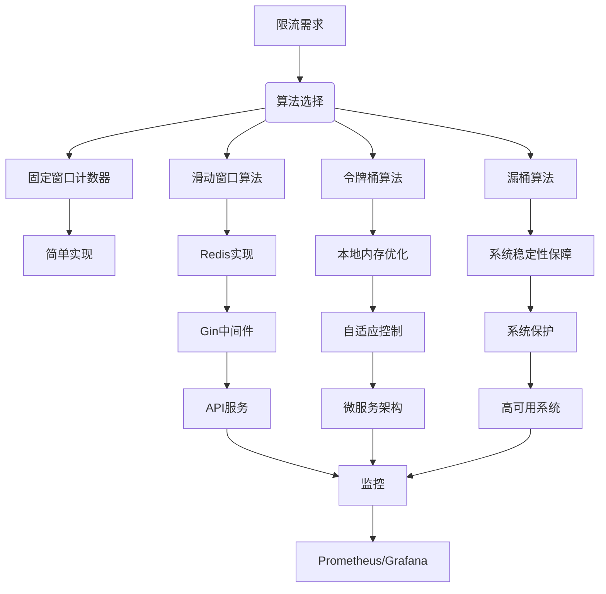

```mermaid
graph TD
    A[限流需求] --> B(算法选择)
    B --> C[固定窗口计数器]
    B --> D[滑动窗口算法]
    B --> E[令牌桶算法]
    B --> F[漏桶算法]

    C --> G[简单实现]
    D --> H[Redis实现]
    E --> I[本地内存优化]
    F --> J[系统稳定性保障]

    H --> K[Gin中间件]
    I --> L[自适应控制]
    J --> M[系统保护]

    K --> N[API服务]
    L --> O[微服务架构]
    M --> P[高可用系统]

    N --> Q[监控]
    O --> Q
    P --> Q
    Q --> R[Prometheus/Grafana]
```
